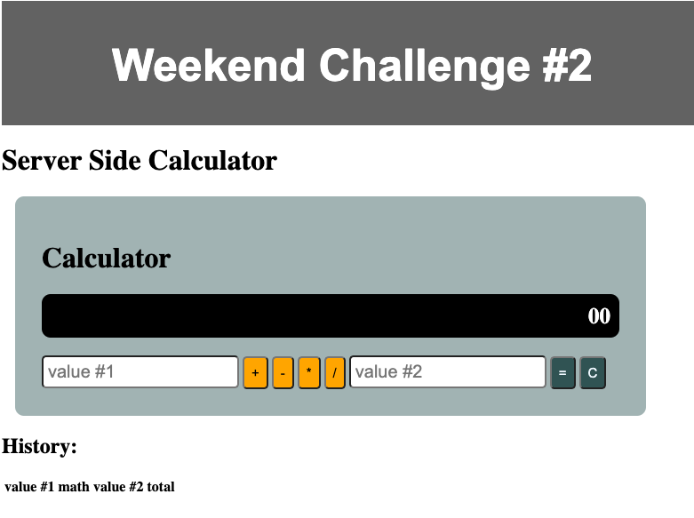
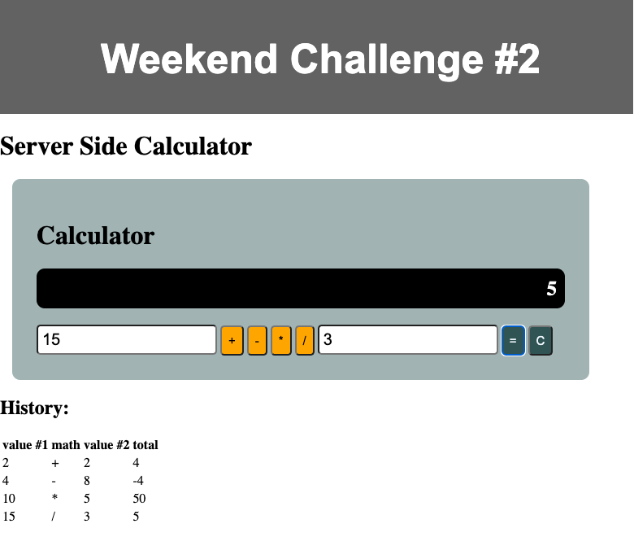

# Weekend Challenge: Server Side Calculator

This is a server-side calculator. The logic for the calculator is implemented on the server. 

### Calculator

this is an interface where the user can input two values (2 input elements) and the select type of mathematical operation. When the submit (`=` button) is clicked, capture this input, bundle it up in an object, and send this object to the server via a POST. There should also be a 'C' button that will clear the user input fields.

it is build out the server-side logic to compute the numbers as appropriate. The server handles Addition, Subtraction, Multiplication, and Division. 

this calculator Keeps a historical record of all math operations and solutions on the server. It displays a list of all previous calculations on the page.

Technologies
------------
* Node
* Express
* SQL

### Images of the application

## Credits

This project was based on an activitie from Prime Academy.
